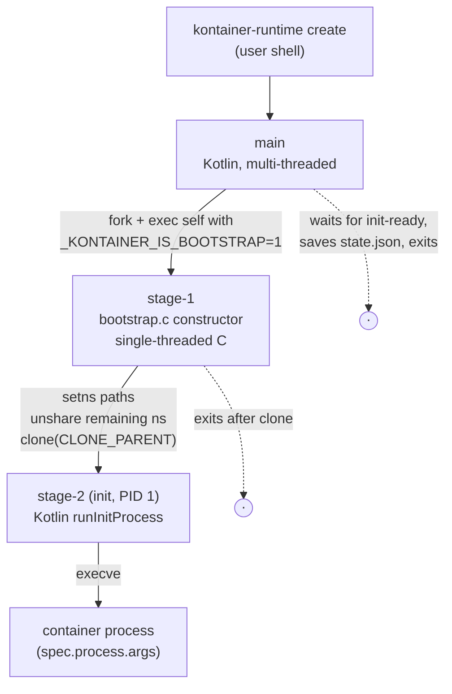
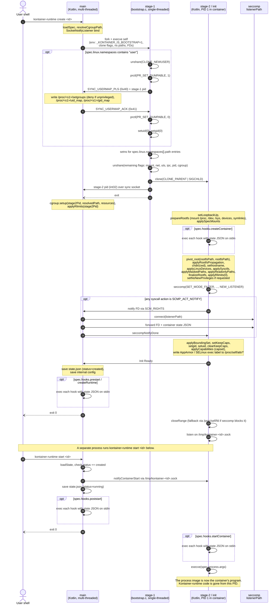

# Architecture

## Process model

Creating a container involves three cooperating processes.

### Main process

The CLI you invoke. Loads the OCI spec, sets up cgroup/rlimits on stage-1, handles the UID/GID mapping handshake, forwards the seccomp notify FD if configured, waits for stage-2 to reach "init ready", saves `state.json`, exits. Also runs `prestart` / `createRuntime` / `poststart` / `poststop` hooks from its own namespace.

### Stage-1

A short-lived C bootstrap living in [`src/nativeInterop/cinterop/bootstrap/bootstrap.c`](https://github.com/ternbusty/kontainer-runtime/blob/main/src/nativeInterop/cinterop/bootstrap/bootstrap.c). It calls `setns` for every `spec.linux.namespaces[].path` entry. The kernel accepts mount-ns `setns` only from a single-threaded process, and PID-ns joining must happen before the fork of stage-2. Stage-1 then runs `unshare` for the remaining namespaces and `clone`s stage-2 with `CLONE_PARENT`, which makes stage-2 a sibling of main. Stage-1 exits right after.

### Stage-2 (init)

PID 1 in the container. Runs `runInitProcess()` in Kotlin. Does `prepareRootfs`, `pivot_root`, `applySysctls`, `applyMaskedPaths`, the capabilities/setuid dance, the seccomp filter install, the `createContainer` hook, waits for the start signal, runs the `startContainer` hook, then `execve`s into the user's program.

## Container lifecycle sequence

The full `create` + `start` flow. UID/GID map handshake, seccomp notify FD forwarding, and hook points all live inside it as `alt` or `opt` blocks. Everything below the "start" divider only runs when the user invokes `kontainer-runtime start #lt;id#gt;` in a separate process.

The `opt` blocks fire when the corresponding OCI feature is present in the spec. On a bare-bones spec (no user namespace, no `SCMP_ACT_NOTIFY`, no hooks) the flow collapses to the linear main-path: fork stage-1, stage-1 unshares and clones stage-2, stage-2 does rootfs + capability + seccomp setup, main saves state and exits, then `start` wakes stage-2 for `execve`.

## Why the C bootstrap

Kotlin/Native spawns GC and runtime worker threads at `main`. Several kernel operations reject multi-threaded callers. `setns(fd, CLONE_NEWNS)` returns `EINVAL`, and PID-ns joining requires the caller to fork afterwards. The bootstrap runs before any Kotlin code, so it can join a mount namespace by path, join a PID namespace before forking stage-2, and unshare the rest of the namespaces.

Stage-2 starts as a fresh single-thread process in the new namespaces. The Kotlin runtime takes over from there.

## Modules

For the directory tree that maps each component onto the source layout, see [Contributing → Repo layout](contributing.md#repo-layout).
